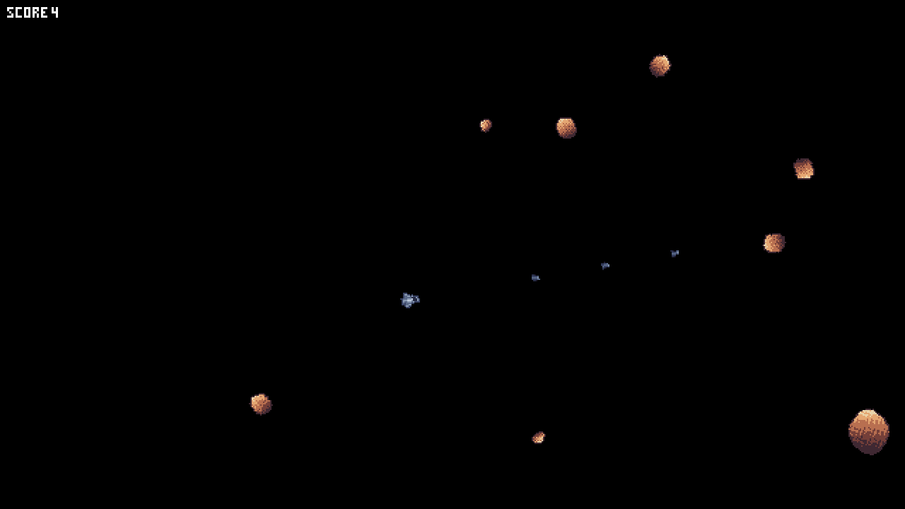

# Mun Example Suite

A collection of Rust-powered Mun example games to showcase its hot reloading functionality.

## Pong (est. 1972) since Mun v0.2.1


## Spaceship (Asteroids-like game) since Mun v0.2.1



## How to Run
```sh
# Build the mun library and watch the src for changes
# This should be done in a different terminal (or tab or on the background)
mun new spaceship
cp resources/spaceship.mun spaceship/src/mod.mun
mun build --manifest-path spaceship/mun.toml --watch
# In a second terminal we link the created library to the current directory and rename it properly.
ln -s spaceship/target/mod.munlib spaceship.munlib
# Run the example
cargo run --example spaceship --features spaceship
```

That should do it, any changes to `spaceship/src/mod.mun will be immediatly reflected on the program via hotreloading.

To run any other example, replace *all* `spaceship` occurences in the above instructions with the example name.

## License

The Mun Example Suite is licensed under either of

 * Apache License, Version 2.0, ([LICENSE-APACHE](LICENSE-APACHE) or
   http://www.apache.org/licenses/LICENSE-2.0)
 * MIT license ([LICENSE-MIT](LICENSE-MIT) or
   http://opensource.org/licenses/MIT)

 at your option.
